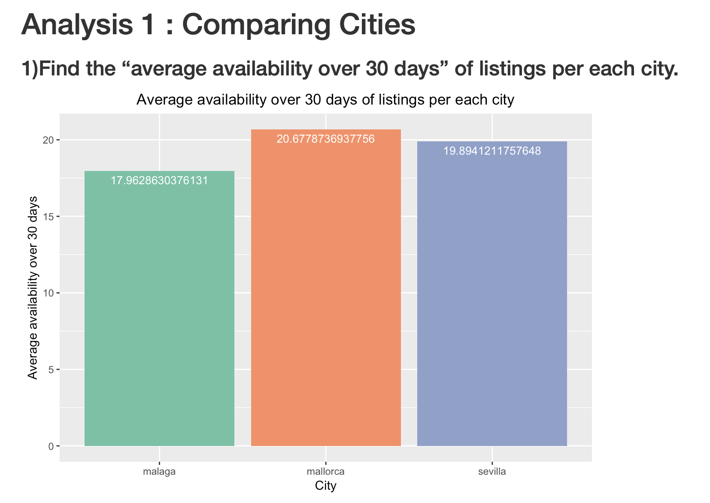
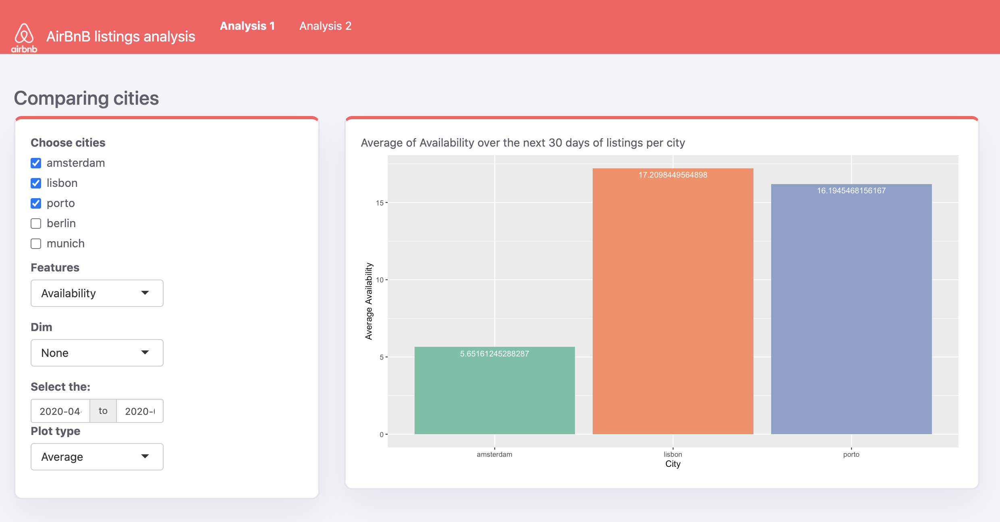
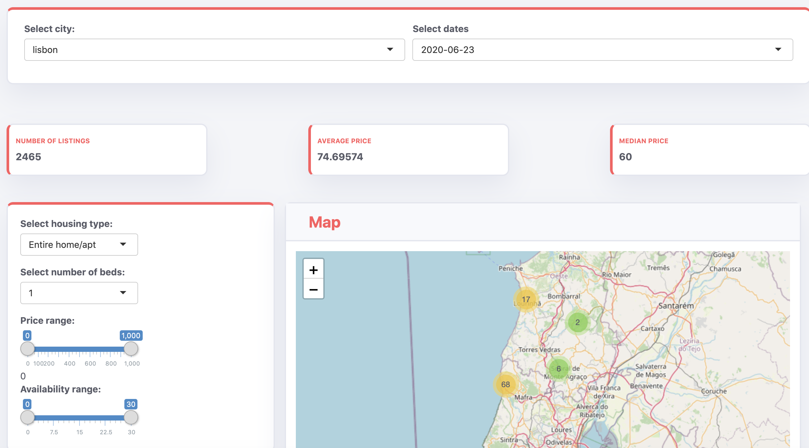

```{r setup, include=FALSE}
knitr::opts_chunk$set(echo = FALSE)
```

## Project objective

Airbnb is an American vacation rental online marketplace company. It allows individuals to rent all or part of their own home as additional accommodation.

As Airbnb data contains a lot of value, we realised an exploratory analysis in order for a real estate agent to take a decision regarding the best option he has to generate profit on the platform from his investment.

## Import Data

We used available data from inside Airbnb published in a form of csv files. The data covers the listings and calendar details from the cities we decided to analyse.

```{r, eval=F, echo=T}
listings <- read.csv(textConnection(readLines(gzcon(url(url)))))
```

```{r, eval=F, echo=T}
 columns_listings <- c("country","city", "date", "id", "neighbourhood_cleansed", 
                        "latitude", "longitude", 
                        "property_type", "room_type", "accommodates", "bedrooms", 
                        "beds", "price", "minimum_nights",  "maximum_nights")
```

```{r, eval=F, echo=T}
listings_cleansed <- listings %>% left_join(calendar, by = c("id" = "listing_id"))
```

```{r, eval=F, echo=T}
dir.create(file.path("Data/data_cleansed", country, city, data_date), recursive = TRUE)
  write.csv(listings_cleansed, file.path("Data/data_cleansed", country, city, data_date, "listings.csv"))
  print(paste0("saving data into ", file.path("Data/data_cleansed", country, city, data_date, "listings.csv")))
```
## Final Data


## Exploratory analysis

As part 1 of this project we performed a simple exploratory analysis to explore the data.


## Shiny Application - Tab 1



## Shiny Application - Tab 2


  
## Documentation


## Conclusion


