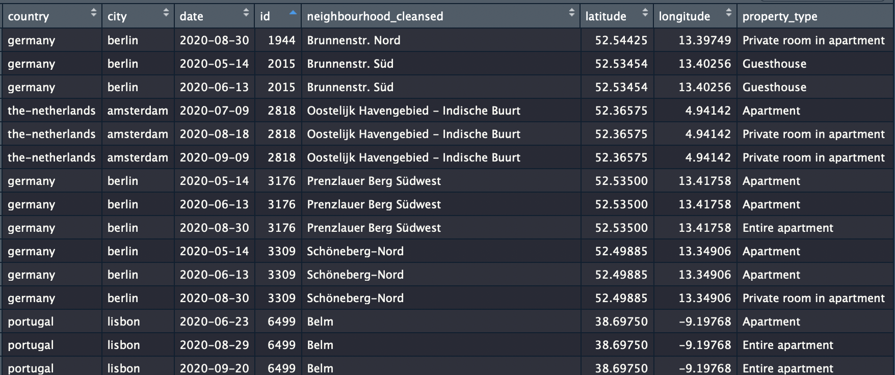
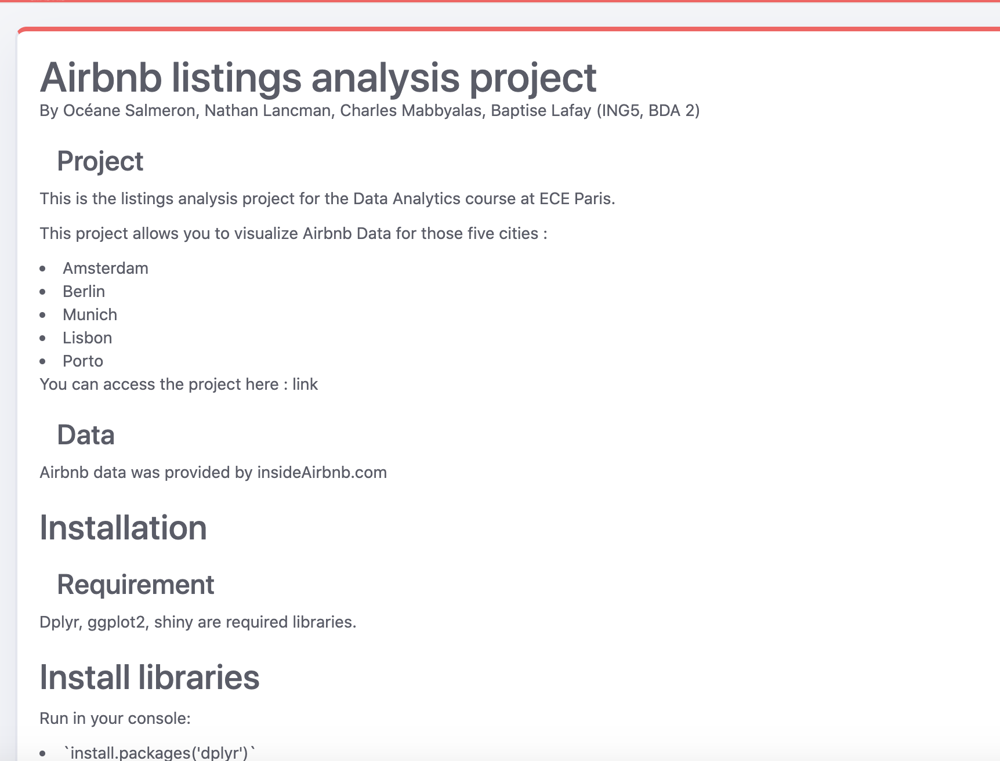

```{r setup, include=FALSE}
knitr::opts_chunk$set(echo = FALSE)
```

## Project objective

Airbnb is an American vacation rental online marketplace company. It allows individuals to rent all or part of their own home as additional accommodation.

As Airbnb data contains a lot of value, we realised an exploratory analysis in order for a real estate agent to take a decision regarding the best option he has to generate profit on the platform from his investment.

We choose 6 different cities for this study :

- Amsterdam
- Berlin
- Bergamo
- Munich
- Lisbon
- Porto

## Data

We used available data from inside Airbnb published in a form of csv files. The data covers the listings and calendar details from the cities we decided to analyse.

Some of the features selected to perform our analysis :

- price : price of the listing per night
- room_type : room type (whole house, shared appartment, ...)
- beds : number of beds in the listing
- lat : latitude for location
- lon : longitude for location : 
- availability_30 : availability over the next 30 days
- revenue_30 : revenue over the next 30 days

## Import Data

### Read csv file from insideAirbnb with its url
```{r, eval=F, echo=T}
listings <- read.csv(textConnection(readLines(gzcon(url(url)))))
```

### Select interesting columns
```{r, eval=F, echo=T}
 columns_listings <- c("country","city", "date", "id", "neighbourhood_cleansed", 
                        "latitude", "longitude", 
                        "property_type", "room_type", "accommodates", "bedrooms", 
                        "beds", "price", "minimum_nights",  "maximum_nights")
```

### Join listing and calendar
```{r, eval=F, echo=T}
listings_cleansed <- listings %>% left_join(calendar, by = c("id" = "listing_id"))
```

### Write cleansed data
```{r, eval=F, echo=T}
dir.create(file.path("Data/data_cleansed", country, city, data_date), recursive = TRUE)
  write.csv(listings_cleansed, file.path("Data/data_cleansed", country, city, data_date, "listings.csv"))
  print(paste0("saving data into ", file.path("Data/data_cleansed", country, city, data_date, "listings.csv")))
```

## Final Data



## Exploratory analysis

As part 1 of this project we performed a simple exploratory analysis to explore the data.


## Shiny Application - Tab 1


## Shiny Application - Tab 2


  
## Documentation


  
## Conclusion

- Nice way of presenting data
- User friendly
- A bit slow to load data


